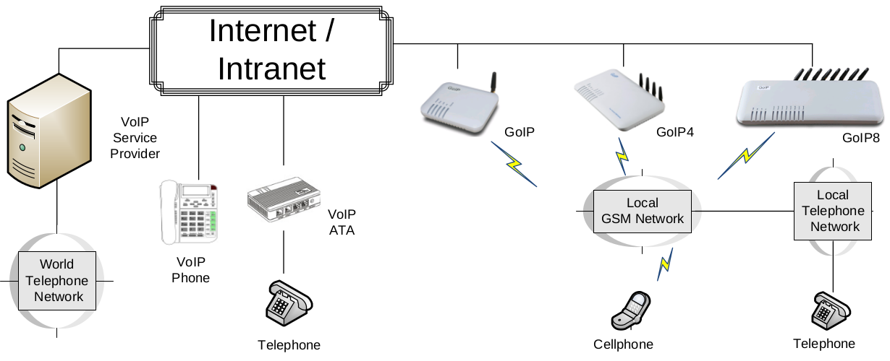

# GoIP User Manual

Revision: 1.2 2012/6/22

## 1 Основное

### 1.1 Введение

GoIP is the abbreviated from GSM over IP. It is a new type of VoIP gateway that allows call terminations from a VoIP network to a GSM network and vice versa. Call connections between IP networks and GSM networks are now bridged seamlessly to extend the voice communication coverage significantly. As the traditional PSTN lines are starting to disappear in developed countries and are not going to be built extensively in under-developed countries, GSM phones are getting more and more popular all over the world with lower and lower service charges, the emergence of GoIP bridges the gap between the traditional telephone networks and VoIP networks as shown in the diagram below. As a result, local and worldwide voice communications are more convenience, lower cost, and broader coverage.

You can now make a call from anywhere in the world via a VoIP network and then terminate the call via a GoIP to the local telephone network (PSTN). On the other hand, you can also make a call from the local telephone network to a GoIP (the GSM phone number) and then dial another number via a VoIP network to anywhere in the world. In these two cases, a VoIP Service provider is required for one side of the call termination. For two fixed locations, it is possible to setup GoIPs at both ends for call terminations without subscribing to a VoIP Service provider.
GoIP can also be used to achieve GSM roaming via VoIP. The idea is to route all your incoming GSM calls to a GoIP via call forward or simply insert your SIM card to a GoIP. You can then setup the GoIP to forward all incoming calls to another GSM number in the world via a VoIP service provider. The charge per call from a VoIP service provider is significantly lower than the roaming charge.
For office environment, GoIP offers a quick way to replace the traditional PSTN lines or T1/E1 lines to your IP PBX. There is no initial installation/reallocation charge and no need to wait for installation. Depending on our usage, you can add or remove lines as per your requirement. You can even configure the system so that everybody calls the same number regardless the number of lines available.

### 1.2 Протоколы

- TCP/IP V4 (IP V6 automatic adaptive)
- Dual VoIP protocols: ITU-T H.323 V4, IETF SIP V2.0
- Multiple Codecs: ITU-T G.711 Alaw/ULaw, G.729A, G.729AB, G.723.1 and GSM
- H.2250 V4
- H.245 V7
- H.235 (MD5, HMAC-SHA1)
- RFC1889 real-time digital transmission protocol
- NAT
- STUN
- Network Management Protocol (NMP)
- PPPoE Dial Up
- PPP Authentication Protocol (PAP)
- Internet Control Message Protocol (ICMP)
- TFTP
- Hypertext Transfer Protocol (HTTP)
- Dynamic Host Configuration Protocol (DHCP)
- Domain Name System (DNS)
- User Account Authentication (via MD5)
- Proprietary Relay Protocol (Avoiding VoIP Blockings)

### 1.3 Hardware Features

- ARM9E processor
- DSP for voice signal processing
- Two 10/100MB Ethernet ports (IEEE 802.3 standard) with status LEDs
- Quadband GSM module (850M 900M, 1800M and 1900M)
- Internal Antenna (optional)

### 1.4 Software Features

- LINUX OS
- Built-in Web Server for device configuration
- Built-in SIP Proxy (Simplified)
- PPPoE Dial Up
- Router function
- DHCP client & Server
- QoS (VLAN)
- VPN (PPTP)
- Online firmware upgrade
- Remote Control Mechanism for remote technical support
- Proprietary Auto Provisioning Mechanism
- Remote SIM function
- Short Messages (SMS) support (standalone and server based)
- Call Management and Routing
- 3GoIP User Manual

### 1.5 Package Content
Use care when unpacking the device package in order to avoid damage to the main unit and the packing materials. Retain the packing materials in case the unit is to be transported in the future.

Please inspect the shipping container and the contents for any damages. If visible damages are present, please contact your vendor. Keep the shipping materials for the carrier inspection.

The package should contain the items listed in the table below

### 1.6 LED Indicators

LED indicators (shown above for GoIP-8) are used to show the current status of the device. They are often used
to determine if the GoIP is working normally or not.

LED Label
Power
Description
This LED is red and illuminates when power is connected.
LAN This LED is red and illuminates when the LAN port is connected and blinks when data
transmission occurs.
PC This LED is red and illuminates when the PC port is connected and blinks when data
transmission occurs.
RUN
Channel “x”
This LED is green and blinks at a rate of every 100ms when VoIP is not ready for
making calls. (Fast Blink)
It blinks at a rate of every second when VoIP is ready for making calls (Slow Blink).
Each GSM channel has its own status LED and its color is green.
1. It blinks at a rate of every 100ms (Fast blink) when the corresponding GSM
channel is not yet registered to a GSM network.
2. It blinks at a rate of every second (Slow blink) when the corresponding GSM
channel is ready for making or receiving calls (registered to a GSM network).
3. It illuminates when GSM call activities occurs (in use, ringing).

## 2 Installation

The installation procedures for GoIP, GoIP-4 and GoIP-8 are the same. The only different is on the number
SIM cards to be installed.

1. SIM card slots are located either at the bottom (for old hardware) or at the back (for new hardware) of the main unit.
For the models with the SIM card slots located at the bottom, you need to open the bottom SIM cover in order to install SIM cards. First slide the metal clip to the direction as indicated on the top of the clip.
Insert a SIM card to each slot carefully and then place the metal clip back in place. For the models with the SIM card slots located at the back, just insert a SIM card to each slot as shown in the drawing on the right. Please make sure that the orientation of the SIM Card is correct before
inserting the card.
For GoIP (1-channel), the SIM card insertion orientation is shown in the figure on the right. The metal contacts must face down and the cut corner is inserted first.
For GoIP-4 and GoIP-8, the SIM card insertion orientation is shown in the figure on the right. The metal contacts must face up and the cut corner is inserted first.
2. The LAN port is intended for intranet or internet connection. Depending on your network environment, it can be connected various type of network equipment, such as network router, network switch / Hub, xDSL/Cable modem, etc.
3. The PC port is intended for network sharing and it supports both bridge and router modes. In Bridge mode, the PC port is connected to the same network segment as the LAN port. In Router mode, the PC port is set to a different network segment. In this case, please make sure that the PC network segment IP (192.168.x.) is different from the one in the LAN port network.
4. The DC port is for power connection. Please only use the AC/DC adapter provided. Adapter with different rating or vendor may damage the device or affect its performance.
5. The Reset button is recessed inside the GoIP cabinet. You need to use a sharp pointer to access the reset button. Press it momentarily to reboot the device. Press it for 15 seconds or more to reset the device settings including login password to its factory defaults.

## 3 Configuration

The device can be configured via its built-in http web server or via an Auto Provision Server. Auto Provision Server is a free utility supporting both Window and Linux OS. This utility is developed by HYBERTONE Technology for the sole purpose of automating the configuration of our products. It is available in our website for free download. This user manual only focuses on the device configuration via its built-in http web server.
Please note that only window based Web browsers, such as IE, Chrome, Firefox, Mozilla, are supported. Do not use Linux based Web browsers. If you are having problems in configuring your device with your existing Web browser, please try one with lower version or a different Web browser and report the problem to us.

### 3.1 HTTP WEB Server Login

There are two methods to access the built-in web server.
1. Method 1 is to access the built-in web server via the LAN port. The LAN port is set to DHCP mode as a factory default. When you connect it to a network with a DHCP host, it will obtain an IP address from the DHCP host automatically. Via the GoIP’s GSM channel(s), there are two ways to find out the IP
address that is assigned to this port.
i. Dial the SIM number of anyone of the GSM channels available. Once the call is answered, dial “*01” to hear a voice prompt reporting the LAN port IP address.
ii. Send the “###INFO###” SMS command to one of the GSM channels available. The GoIP will then return back the LAN port IP address. Please refer to Appendix A Special SMS Commands for more information.
Once the LAN IP address is known, you are now ready to access its built-in http web server by typing its IP address in the address field of a web browser.
2. Method 2 is to access the built-in we server via the PC port. As a factory default, the PC port IP is preset to 192.168.8.1. Connect a computer to the LAN port of the device and configure its IP to 192.168.8.x (x = 2 to 254). Type the IP address 192.168.8.1 in the address field of a web browser.
Once the IP address is entered, the login window shown on the right pops up. Enter the user name and password. There are three level of access via three different user names.
1. Administrative Level -This offers a full access right to all parameters available in the built-in webpage. The user name and password for the administrative level are "admin" and "admin" respectively.
2. User Level - This level restricts user from accessing the Call Setting page. User will not be able to change any VoIP related settings.
The user name and password for the user level are "user" and "1234" respectively.
3. SMS Level - This level only allows user to access the Send SMS and SMS Box functions under the Tool menu. The user name and password for 8GoIP User Manual
the SMS level is "sms" and "1234".

### 3.2 Status
This is the default page when you first login to the built-in HTTP Web server. It consists of three columns as shown in the diagram below. All three models use the same status page design. It is important to understand the information shown in this page in order to debug or report problems encountered.

